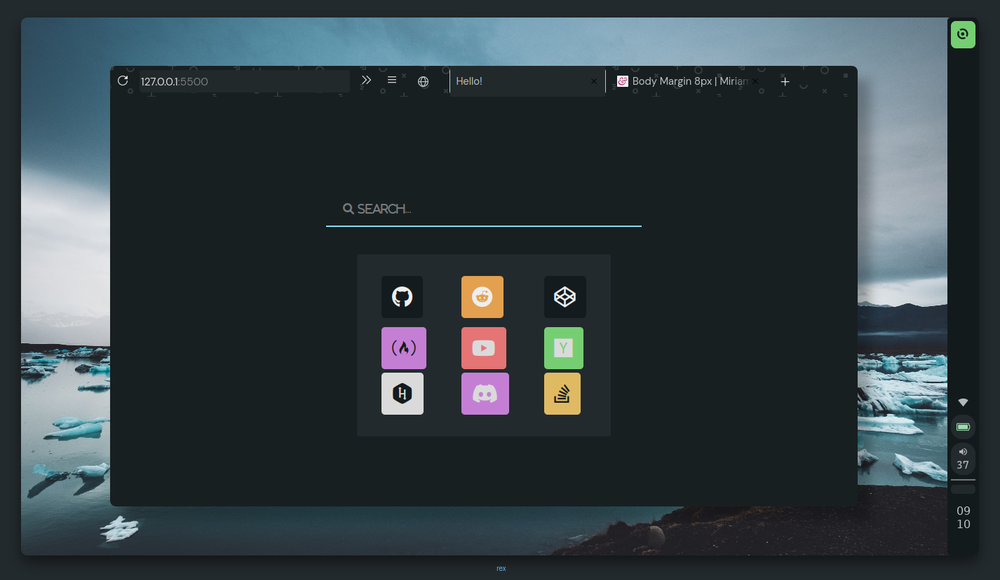

<h2 align="center">Everblush StartPage</h2>

 

# Preview 

 
 

## Installation
- Open your startpage settings >> New Windows and Tabs >> Homepage and New Windows select Custom Url >> enter everblush.github.io/startpage.  

## Credits 💝
- [Mehedi](https://github.com/mehedirm6244).

